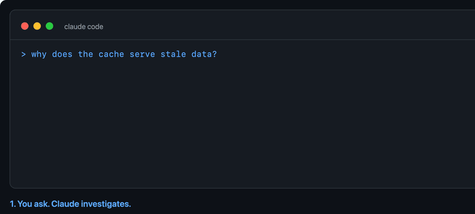
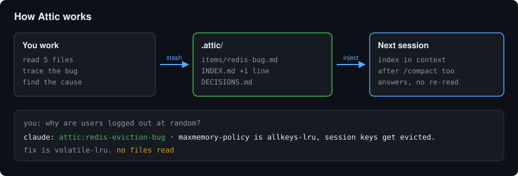
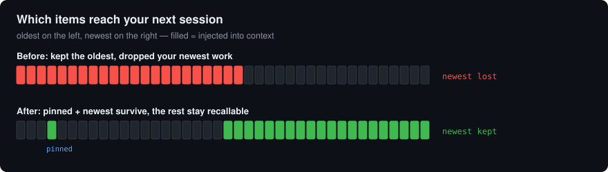
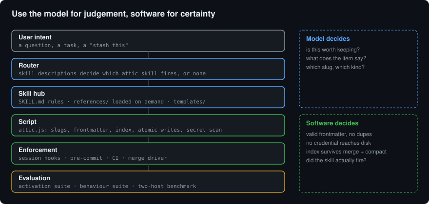
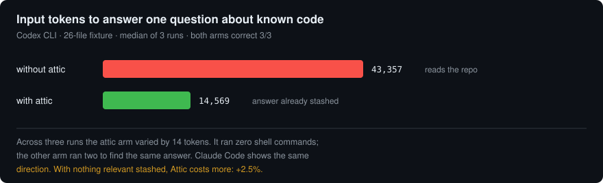

# Attic

[](CHANGELOG.md)
[](#install)
[](docs/CODEX.md)
[](skills/attic/evals/results/)
[](SECURITY.md)
[](LICENSE)

**Offload context.** A plugin for [Claude Code](https://claude.com/claude-code) and [Codex CLI](https://developers.openai.com/codex) that stashes findings, decisions and long outputs into a project-local `.attic/` folder and keeps only a one-line index in the conversation. The live context stays lean, and what matters survives `/compact`, `/clear` and new sessions.



Most token-saving tools shorten what Claude writes. Attic targets a different sink: the knowledge Claude keeps re-reading and re-explaining because it lives nowhere but the chat.



```
you:    why does the login test time out?
claude: `attic:login-test-timeout` · 5s fixture timeout in tests/conftest.py:41, SMTP call is real. Fixing now.
```

The full trace, the files it read and the reasoning are in
`.attic/items/login-test-timeout.md`. Three hours and one `/compact` later,
Claude still knows.

## Install

**Claude Code**

```
claude plugin marketplace add NishikantaRay/Attic
claude plugin install attic@attic
```

**Codex CLI**

```sh
codex plugin marketplace add NishikantaRay/Attic
codex plugin add attic@attic
```

Then run `/hooks` once in an interactive session to trust the attic hooks;
Codex does not run hooks it has not reviewed. Same skills, same script, same
hooks as the Claude Code build. Details, alternatives and exactly what was
verified: [docs/CODEX.md](docs/CODEX.md).

Requires Node.js on `PATH` for the hooks. Without Node the skills and commands still work; only the automatic session-start injection is lost.

Try it without installing:

```
git clone https://github.com/NishikantaRay/Attic
claude --plugin-dir ./Attic
```

## Commands

| Command | What it does |
|---|---|
| `/attic [lite\|full\|ultra\|off]` | Set the level. No argument means `full`. |
| `/attic default <level>` | Make a level the default for new sessions. |
| `/attic-stash [title]` | Stash the latest finding, result or decision and get its handle. |
| `/attic-recall <slug or words>` | Pull an item back and summarise it. |
| `/attic-index` | List everything stashed in this project. |
| `/attic-sweep` | Save plan, open questions and in-progress state. Run before `/compact`. |
| `/attic-pin <slug>` | Always inject this item, never trim it. |
| `/attic-prune` | Archive stale items. Dry run by default, never deletes. |
| `/attic-stats` | What the attic costs and holds, measured locally. |
| `/attic-doctor` | Check `.attic/` for drift, orphans and leaked credentials. |
| `/attic-git` | Fix `.attic/` merge conflicts and set up a shared team attic. |

If the index ever gets out of step with the items, it is derived data and can
be regenerated: `node skills/attic/scripts/attic.js rebuild`. The item files
are the source of truth, so nothing is lost.
| `/attic-help` | One-screen reference. |

Installed plugins are namespaced, so the fully qualified form is `/attic:attic-help`; the short form works when no other plugin claims the name.

Claude also stashes on its own at `full` and `ultra`, and reacts to phrases like "stash this", "remember this for later", "before compact" and "what did we find about X".

## Levels

| Level | What changes |
|---|---|
| `lite` | Stash only on `/attic-stash`, at the end of a task, or when asked to sweep. Normal replies otherwise. |
| `full` | After every investigation, write the conclusion to the attic and reply with the handle plus three lines. Never re-explain what is in the attic. Decisions logged. Long output summarised and stashed, never pasted. Default. |
| `ultra` | Everything non-trivial is stashed. Replies are handle plus three lines. Claude must check the index before re-reading anything it has already seen. |
| `off` | Dormant. |

`ATTIC_DEFAULT_MODE=lite|full|ultra|off` sets the starting level. `/attic default <level>` does the same and persists it to `~/.claude/attic/config.json` (or the plugin data dir).

## What ends up in `.attic/`

```
.attic/
  INDEX.md          one line per item:  - [slug](items/slug.md) · kind · one-line hook
  DECISIONS.md      append-only:        - 2026-09-04 · use lru_cache · because one line beats a cache class
  items/<slug>.md   frontmatter (title, kind, date, tags) + the content
  archive/<slug>.md pruned items: still recallable, no longer injected
```

### How the index scales

The index is injected at every session start, so it cannot grow without
bound. Three tiers share a fixed budget:

| Tier | Rule |
|---|---|
| Pinned | `/attic-pin` marks these. Always injected, never trimmed. |
| Recent | Newest items fill the remaining budget. |
| Rest | Collapsed to one line naming the counts, so older knowledge stays discoverable via `/attic-recall`. |

Trimming drops the oldest unpinned entries. Your newest finding is never the
one that disappears.



Kinds: `finding`, `decision`, `plan`, `output`, `note`. Handles look like `attic:<slug>`.

**Always stashed verbatim:** code, commands, file paths, line numbers, error text.
**Never stashed:** secrets, tokens, credentials, one-line answers, typo fixes.

### Git

`.attic/` is plain Markdown. Two sensible choices:

- **Commit it** for shared team memory. New contributors (and new Claude sessions) start with the index.
- **Ignore it** (`echo .attic/ >> .gitignore`) if you want it personal.

If you commit it, run `/attic-git`. `INDEX.md` and `DECISIONS.md` are
append-only, so two branches that each stash something conflict on every
merge. The command installs a union merge driver that keeps both sides.
See [docs/TEAM.md](docs/TEAM.md).

## How it works

Three hooks, all zero-dependency Node scripts in [hooks/](hooks/):

| Event | Script | Effect |
|---|---|---|
| `SessionStart` (startup, resume, clear, compact) | `attic-activate.js` | Injects the rules for the active level plus `.attic/INDEX.md` (capped at 60 lines / 4 KB). This is what makes the attic survive `/compact`. |
| `UserPromptSubmit` | `attic-mode.js` | Tracks `/attic <level>` and `/attic default <level>`, confirms the change. Silent on every other prompt. |
| `SubagentStart` | `attic-subagent.js` | Briefs subagents so they stash instead of dumping into their report. |

The ruleset itself lives in [skills/attic/SKILL.md](skills/attic/SKILL.md). The other skills are the slash commands.

## Architecture

Attic is built as a versioned, testable, enforceable component rather than a
Markdown prompt. See [docs/ARCHITECTURE.md](docs/ARCHITECTURE.md) for the full
layer map.



```
skills/attic/
├── SKILL.md          the hub: scope, rules, routing
├── references/       domain knowledge, loaded on demand
├── scripts/attic.js  deterministic file operations
├── templates/        output shapes
└── evals/            activation + behaviour suites
```

The split that matters: **the model decides what is worth stashing and writes
the prose; the script owns everything mechanical.** Slug hygiene, frontmatter,
index bookkeeping, atomic writes and credential detection are software
concerns, so `scripts/attic.js` handles them and exits non-zero when something
is wrong. "Never stash secrets" is still in the instructions, but it is no
longer the only thing enforcing it.

```bash
node skills/attic/scripts/attic.js stash --slug x --kind finding --hook "..." --body "..."
node skills/attic/scripts/attic.js recall "login timeout"
node skills/attic/scripts/attic.js validate     # exit 3 on drift or a leaked credential
```

## Does it actually help?

Sometimes. Here is the measurement, including where it does not.



The benchmark asks one question about code whose answer is already stashed,
against a 26-file fixture, and counts real input tokens from the CLI's own
usage output. Both arms are graded for correctness, because a cheaper wrong
answer is not a win. It runs on both supported hosts.

**Codex CLI**, three runs per arm:

| Case | Without attic | With attic | Delta |
|---|---|---|---|
| Answer is stashed | 43,357 | 14,569 | **-66.4%** |
| Nothing relevant stashed | 28,654 | 29,363 | **+2.5%** |

**Claude Code**, two independent runs of three:

| Case | Without attic | With attic | Delta |
|---|---|---|---|
| Answer is stashed, run 1 | 90,263 | 30,163 | **-66.6%** |
| Answer is stashed, run 2 | 90,272 | 60,687 | **-32.8%** |
| Nothing relevant stashed | 57,698 | 60,428 | **+4.7%** |

Correctness held at 18 of 18 across both hosts, both arms and both cases.

**Read that honestly.** On Claude Code, two runs of the same benchmark differ
by more than 30 points, so no single percentage from that host is
trustworthy. Codex is far steadier: its attic arm varied by 14 tokens across
three runs. What both hosts agree on is the direction. When the answer is
already stashed the attic arm costs fewer input tokens and fewer turns,
because its cost does not depend on how much the model decides to read. On
Codex the attic arm ran zero shell commands against two for the arm that had
to search. When nothing relevant is stashed, the attic is pure overhead, and
the last row of each table is what that looks like.

```bash
node benchmarks/run.js --runs 3                 # Claude Code
node benchmarks/run.js --host codex --runs 3    # Codex CLI
```

Full method, raw samples and the reasons not to quote a headline number:
[benchmarks/README.md](benchmarks/README.md) and
[docs/HONEST-NUMBERS.md](docs/HONEST-NUMBERS.md).

## Evaluation

Activation and behaviour are measured separately.

```bash
node scripts/run-evals.js --suite activation   # real headless sessions, scores the classifier
node scripts/run-behavior.js                   # real sessions, graded on files + reply
node scripts/run-evals.js --suite behavior     # the remaining judgement-call checklist
node scripts/run-evals.js --case act-22        # a single case
```

Activation proves the right skill fires. Behaviour proves it then does its
job: `run-behavior.js` seeds an attic, runs a real headless session, and
asserts on what landed on disk and what the reply said. It is what catches a
skill that activates correctly and then does nothing.

The activation suite reports accuracy, coverage, false positive rate, false
negative rate and wrong-skill rate over positive cases, negative cases, and
collision cases. Current baseline: 100% across 22 cases, recorded in
[skills/attic/evals/results/](skills/attic/evals/results/).

Attic publishes no headline savings percentage, because a reproducible
baseline for agent sessions does not exist. `/attic-stats` reports what is
measurable on your machine and says where the attic costs more than it
returns. See [docs/HONEST-NUMBERS.md](docs/HONEST-NUMBERS.md).

## Enforcement

| Layer | Mechanism |
|---|---|
| Session start | `hooks/attic-activate.js` injects the index, so the attic survives `/compact`. |
| Write time | `scripts/attic.js` refuses credentials with exit code 2. |
| Commit time | `scripts/attic-precommit.sh` blocks a commit with a malformed or leaking `.attic/`. |
| CI | `.github/workflows/ci.yml` runs tests and manifest validation; `attic-guard.yml` validates `.attic/` on pull requests. |
| Merge time | `scripts/attic-merge.js` resolves index conflicts instead of losing one side. |

## Project files

[CHANGELOG.md](CHANGELOG.md) · [docs/CODEX.md](docs/CODEX.md) · [CONTRIBUTING.md](CONTRIBUTING.md) · [SECURITY.md](SECURITY.md) · [docs/ARCHITECTURE.md](docs/ARCHITECTURE.md) · [docs/HONEST-NUMBERS.md](docs/HONEST-NUMBERS.md) · [docs/TEAM.md](docs/TEAM.md)

## Repository layout

```
skills/            the skills, shared by both hosts
hooks/             session hooks, shared by both hosts
scripts/           tooling; scripts/codex/ holds the Codex launcher and installer
codex/             GENERATED Codex plugin — do not edit, run npm run build:codex
.agents/plugins/   Codex marketplace manifest; makes this repo installable with codex plugin add
benchmarks/        the two-arm benchmark and its recorded results
docs/              architecture, honest numbers, team workflow, Codex notes
```

Claude Code loads `skills/` and `hooks/` directly through its plugin
manifest. Codex gets the same content via the generated `codex/` build, which
carries a `.codex-plugin/plugin.json` of its own; `.agents/plugins/` makes
the repository a Codex marketplace.

## Development

```
npm test                          # unit tests: hooks, script, eval suite integrity
claude plugin validate . --strict # manifest and component checks
claude --plugin-dir .             # load this checkout into a session
npm run build:codex               # regenerate codex/ after changing a skill
npm run bump -- 1.2.0             # move every version string together, then rebuild
npm run bench                     # the two-arm token benchmark
npm run make:assets               # regenerate the README diagrams
```

## Uninstall

```
claude plugin uninstall attic@attic
```

`.attic/` folders in your projects stay where they are; delete them if you want.

## License

MIT
