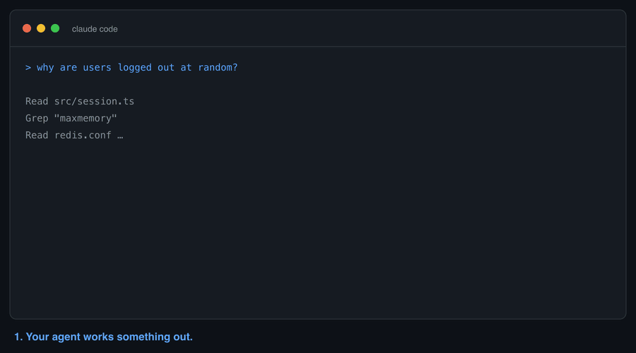
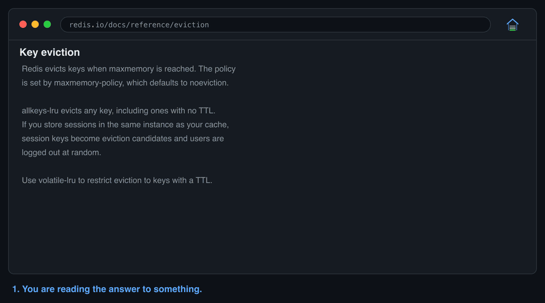
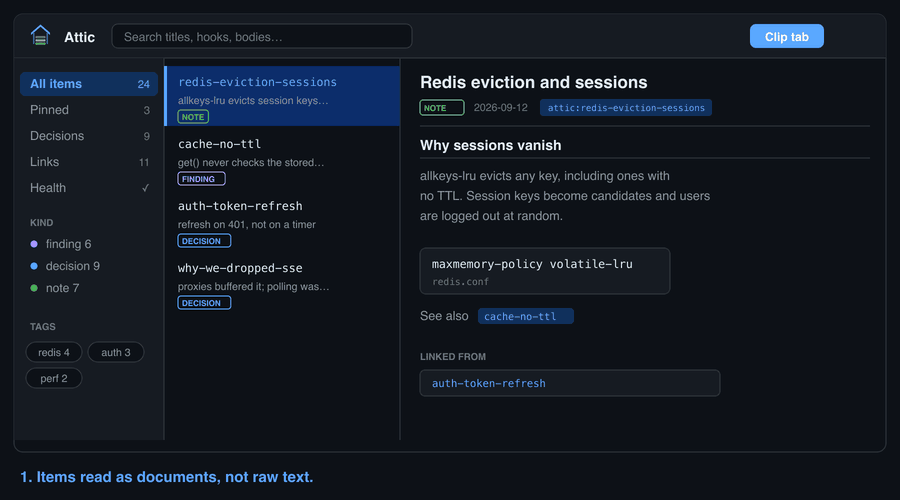

<p align="center">
  <picture>
    <source media="(prefers-color-scheme: dark)" srcset="assets/logo-wide.svg">
    <source media="(prefers-color-scheme: light)" srcset="assets/logo-wide-light.svg">
    
  </picture>
</p>

<p align="center">
  <a href="CHANGELOG.md"></a>
  <a href="#install"></a>
  <a href="docs/CODEX.md"></a>
  <a href="skills/attic/evals/results/"></a>
  <a href="SECURITY.md"></a>
  <a href="LICENSE"></a>
</p>

**Your coding agent forgets what it just figured out.** Attic writes it down,
so tomorrow it already knows.

A plugin for [Claude Code](https://claude.com/claude-code) and
[Codex CLI](https://developers.openai.com/codex).

<picture>
  <source media="(prefers-color-scheme: dark)" srcset="assets/hero.gif">
  <source media="(prefers-color-scheme: light)" srcset="assets/hero-light.gif">
  
</picture>

## What it does

You ask your agent to investigate something. It reads ten files, traces the
flow, works out the answer. Then the context fills up, `/compact` runs, and
that understanding is gone. Tomorrow it reads the same ten files again.

Attic writes what the agent learns to a `.attic/` folder in your project, and
keeps a one-line index in the conversation:

```
you:    why are users logged out at random?
claude: attic:redis-eviction-bug · maxmemory-policy is allkeys-lru,
        so session keys get evicted. Fix is volatile-lru.
```

The detail lives in `.attic/items/redis-eviction-bug.md`. The chat holds a
handle. After a compaction, a new session, or a week away, the finding is
still there.


## Install

**Claude Code**

```
claude plugin marketplace add NishikantaRay/Attic
claude plugin install attic@attic
```

**Codex CLI**

```sh
codex plugin marketplace add NishikantaRay/Attic
codex plugin add attic@attic
```

On Codex, run `/hooks` once in an interactive session and trust the attic
hooks — Codex will not run a hook it has not reviewed. Skills work without
this; only the automatic loading needs it. [More on
Codex](docs/CODEX.md).

## Try it

Check it is on:

```
/attic-help
```

If a reference card prints, you are set. Then just work normally. After the
agent investigates something, look for a handle like `attic:some-finding` in
its reply, and run `ls .attic/items/` to see what it kept.

To see the difference for yourself:

```sh
sh scripts/try-attic.sh
```

That builds a throwaway project with one real bug, asks the same question
twice — once with the finding stashed, once without — and prints both
answers with their token counts. Nothing outside a temp folder is touched.

## The commands you will actually use

| Command | What it does |
|---|---|
| `/attic-stash` | Keep this finding |
| `/attic-recall <topic>` | What did we learn about X? |
| `/attic-index` | Show everything kept in this project |
| `/attic-sweep` | Save the session before `/compact` |
| `/attic-review` | Which findings may no longer match the code? |
| `/attic-fail` | Record an approach that did not work, so it is not retried |

Five more exist for pinning, pruning, health checks and git setup. Full list
with every flag: [docs/COMMANDS.md](docs/COMMANDS.md).

## How much it keeps

`/attic off` turns it off. `/attic` turns it back on.

| Level | Behaviour |
|---|---|
| `lite` | Only keeps things when you ask |
| `full` | Keeps findings after each investigation. **Default** |
| `ultra` | Keeps everything non-trivial, replies get very short |
| `off` | Dormant |

Start with `full`. If it feels chatty, drop to `lite`.

## Knowing when to trust a finding (1.6)

Remembering something is only half the problem. The other half is knowing
whether it is still true.

```
Agent discovers something
        ↓
Attic stores the finding + the evidence it came from
        ↓
New session recalls the finding
        ↓
Attic checks whether that evidence moved
        ↓
Agent reuses it, or verifies it first
```

A finding now records where its knowledge came from: the files it was read
from, the commands that produced it, the commit it was recorded at, and how
far it was actually checked. On recall, Attic compares that against the tree
as it is now:

```
[auth-order] Auth middleware runs after route registration
finding · verified · possibly-stale
revision: a1b2c3d (now e4f5g6h)
evidence: src/middleware/auth.ts

⚠ Possibly stale
referenced file(s) changed since a1b2c3d: src/middleware/auth.ts
Verify against the current working tree before reuse.
```

`/attic-review` lists everything in that state; `verify` records that you
looked and it still holds.

### The trust model

Read this part before relying on any of it.

- Attic stores knowledge. It does **not** guarantee any finding is still true.
- `possibly-stale` means **a file underneath the finding changed**. It does not
  mean the finding is wrong, and Attic never decides that it is. Only a person
  or an agent that reads the code can.
- `current` means nothing it cites has moved. That is evidence, not proof: a
  finding can be wrong the day it is written, and Attic cannot tell.
- `verified` means somebody claimed they checked it, on some past date. It is a
  record of an act, not a fact about the code today.
- Unknown provenance is different from verified provenance. An item with no
  evidence is not a suspect item — it is an unchecked one, and the two should
  be read differently.
- Nothing is ever deleted or rewritten because it looks stale. A finding that
  no longer holds gets flagged and keeps its text, because knowing what was
  once believed, and why, is often the useful part.

Attic tracks **whether the ground moved**, not whether the conclusion survived.
Treat a warning as a prompt to look, never as a verdict.

## What ends up in your project

```
.attic/
  INDEX.md          one line per finding
  DECISIONS.md      what was decided, and why
  items/*.md        the findings themselves
```

Plain Markdown you can read and edit. Commit it and your team shares the
knowledge; add it to `.gitignore` and it stays personal.

If you commit it, run `/attic-git` once. `INDEX.md` is append-only, so two
branches both adding a finding will conflict every time; that command installs
a merge driver that keeps both sides. [Team setup](docs/TEAM.md).

The index is injected into every session, so it cannot grow forever. Pinned
items always survive, newest fill the remaining room, and older ones collapse
to a single line you can still search. Your newest finding is never the one
that disappears.

## Does it actually help?

Sometimes. Here is the evidence, including where it does not.

**The real test**: three sessions on a private monorepo with auth spread
across a server, three clients and an Electron process. Investigate the auth
flow; then, in a **fresh session told nothing about the first**, add account
lockout; then, in another fresh session, add password change.

| | No Attic | Attic | |
|---|---:|---:|---:|
| Input tokens | 5,935,224 | 3,938,927 | **−34%** |
| Cost | $6.35 | $5.02 | −21% |
| Correctness | 13/13 | 13/13 | tie |

The shape matters more than the total. Session 1 is a wash (−6%), session 2
saves 36%, session 3 saves 43%. The benefit compounds as sessions accumulate.

**Both arms were correct**, so this did not make the agent smarter. It made
the same quality cheaper.

**Where it costs you.** On a short session, or a question you never ask
twice, the index is overhead you pay for nothing — measured at +2.5% on one
benchmark case. That is why `off` exists. No headline percentage is quoted
because agent sessions are not reproducible enough to support one:
[the full accounting](docs/HONEST-NUMBERS.md).

Method, prompts and raw results:
[benchmarks/auth-investigation/](benchmarks/auth-investigation/).

## Clip from your browser

The answer is often in a tab: an MDN page, an issue thread, a changelog. The
[browser extension](extension/) puts it in the same attic your agent writes to.
It works on Chrome, Brave, Edge and other Chromium browsers.

### Select it, stash it

Select the part that matters, right-click, done. No form, no filename, no tab
switch — and next session your agent answers from it without reading a file.

<picture>
  <source media="(prefers-color-scheme: dark)" srcset="assets/clip.gif">
  <source media="(prefers-color-scheme: light)" srcset="assets/clip-light.gif">
  
</picture>

### Then read it back

Clicking the toolbar icon opens a library over your `.attic/`: items rendered
as markdown, `[[slug]]` links between them with backlinks, full-body search,
`⌘K` to jump anywhere, and editing in place.

<picture>
  <source media="(prefers-color-scheme: dark)" srcset="assets/library.gif">
  <source media="(prefers-color-scheme: light)" srcset="assets/library-light.gif">
  
</picture>

### Setting it up

```
npm run attic:serve -- --root /path/to/project
```

Then load `extension/` unpacked at `chrome://extensions` (or
`brave://extensions`) and press Connect. On Brave, allow localhost access in
Shields — it blocks extension pages from reaching `127.0.0.1`, which looks
exactly like a companion that is not running.

It is not on the Chrome Web Store: it writes to your filesystem through a
companion you start yourself, which is not something a store install can
offer.

[Setup, security model and endpoints](extension/README.md).

## Privacy

No telemetry. No API keys. Nothing leaves your machine. Everything stays in
your project folder. The script refuses to write anything that looks like a
credential. [Security notes](SECURITY.md).

The plugin itself makes no network calls at all. The optional browser
extension talks to a companion on `127.0.0.1` that you start yourself — bound
to loopback, token-authenticated, and limited to the project roots you name.

Provenance is deliberately conservative about what it records. File paths are
stored relative to the repository root, never as absolute paths that would name
your home directory in a file your team may commit. Commands are stored as the
command line only, never their output, and any command line that trips the
credential scanner is dropped while the finding itself is still saved.

## More

[Why your AI keeps forgetting](blog/why-your-ai-keeps-forgetting.md) ·
[The answer was in a tab](blog/the-answer-was-in-a-tab.md) ·
[Measuring agent memory](blog/measuring-agent-memory.md) ·
[Quickstart](docs/QUICKSTART.md) ·
[All commands](docs/COMMANDS.md) ·
[Codex setup](docs/CODEX.md) ·
[Browser extension](extension/README.md) ·
[Team setup](docs/TEAM.md) ·
[How it is built](docs/ARCHITECTURE.md) ·
[Contributing](CONTRIBUTING.md) ·
[Changelog](CHANGELOG.md)

## Uninstall

```
claude plugin uninstall attic@attic     # Claude Code
codex plugin remove attic               # Codex CLI
```

Your `.attic/` folders stay where they are. Delete them if you want.

## License

MIT
