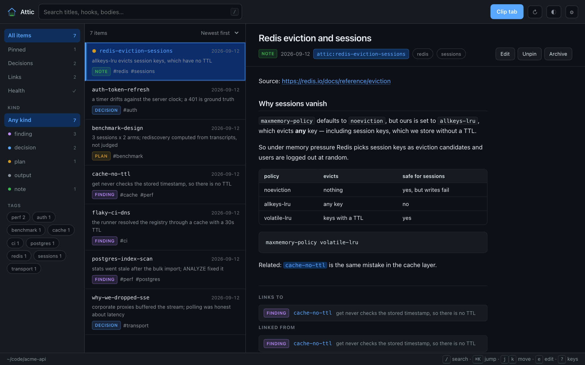
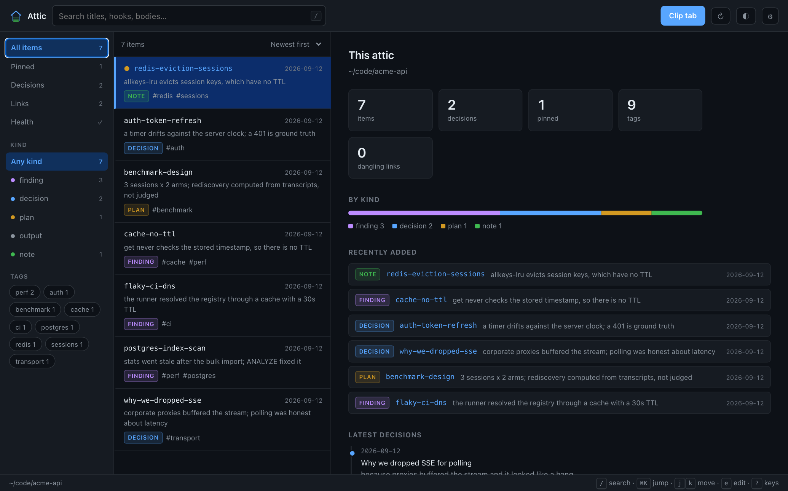
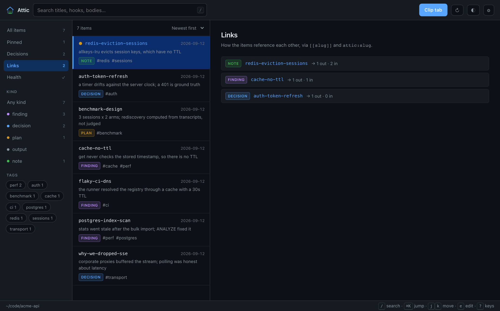
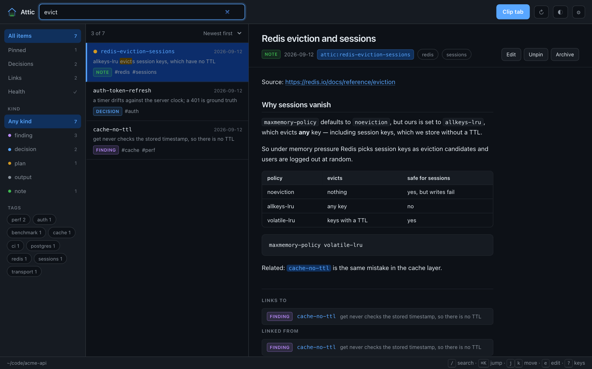
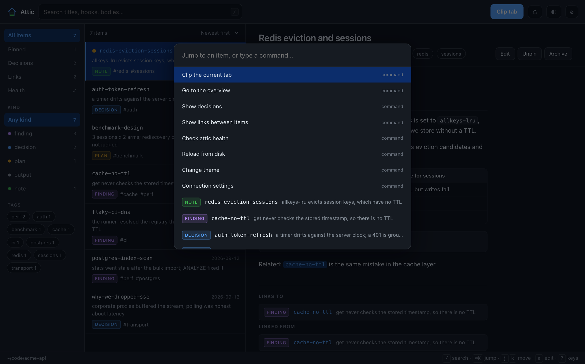
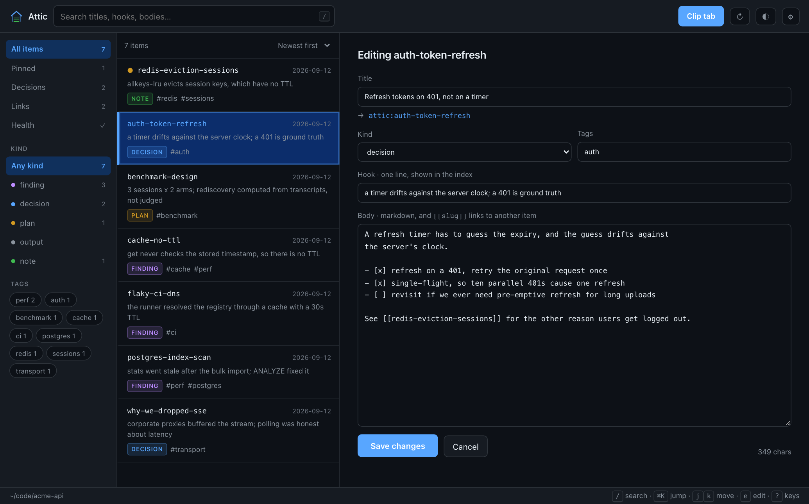

# Attic for Chrome, Brave and other Chromium browsers

Clip a page into your project's `.attic/`, and browse what's already there.

Works on **Chrome, Brave, Edge, Vivaldi and Opera** — it is a standard MV3
extension with no Chrome-only APIs. Brave needs one extra step; see
[Brave](#brave) below.


## Why there is a companion process

A Chrome extension cannot write to your filesystem. `chrome.fileSystem` is
ChromeOS-only, and the File System Access API needs a folder re-picked per
profile with permission that does not survive reliably. So the extension talks
to a small Node server on `127.0.0.1` that you start yourself.

That server does **not** reimplement Attic. It `require()`s
`skills/attic/scripts/attic.js` and calls the same functions the CLI does, so
clips get the same frontmatter, the same slug rules, the same INDEX and
DECISIONS bookkeeping, the same atomic writes — and the same secret scan.

## Install

**1. Start the companion:**

```sh
npm run attic:serve -- --root /path/to/your/project
```

Pass `--root` once per project you want to clip into, and `--port` if 8787 is
taken.

**2. Load the extension:** open `chrome://extensions` (Brave:
`brave://extensions`, Edge: `edge://extensions`), turn on Developer mode,
click **Load unpacked**, and select this `extension/` folder.

**3. Click the toolbar icon and press Connect.** There is no token to copy:
the library finds the companion on the usual ports and pairs with it. See
[Pairing](#pairing) for what that costs.

## Using it

Clicking the toolbar icon opens the **library** in a full tab: a navigation
rail, the item list, and a reading pane.

<picture>
  <source media="(prefers-color-scheme: dark)" srcset="../assets/screenshots/library.png">
  <source media="(prefers-color-scheme: light)" srcset="../assets/screenshots/library-light.png">
  
</picture>

*(Screenshots are generated from the real UI by `npm run screenshots`, against
an attic written by the real `attic.js`.)*

**Read** — item bodies render as markdown, not as a wall of monospace:
headings, lists, tables, task lists and fenced code with its language. Long
items get an outline rail on the right. The renderer is hand-rolled (MV3's CSP
blocks a CDN parser) and escapes before it adds any structure, so a clipped
page cannot inject markup.

**Follow links** — write `[[another-slug]]` in a body and it becomes a link to
that item; `attic:some-slug` handles link too. Each item lists what it **links
to** and what is **linked from** it, so an attic reads as a connected set
rather than a folder. A link to a slug that does not exist yet shows as
dangling instead of a dead click.

**Navigate** — the rail carries the views (All, Pinned, Decisions, Links,
Health), the kinds with their counts, and every tag in the attic. Tags are
clickable everywhere they appear.

**Overview** — the landing pane shows what the attic contains: counts, the
spread across kinds, what was added recently, and the latest decisions with
their why.

<picture>
  <source media="(prefers-color-scheme: dark)" srcset="../assets/screenshots/overview.png">
  <source media="(prefers-color-scheme: light)" srcset="../assets/screenshots/overview-light.png">
  
</picture>

**Decisions** — the full DECISIONS.md as a timeline, each entry split into what
was decided and why.

**Links** — which items reference each other, and every dangling reference with
the item that made it.

<picture>
  <source media="(prefers-color-scheme: dark)" srcset="../assets/screenshots/links.png">
  <source media="(prefers-color-scheme: light)" srcset="../assets/screenshots/links-light.png">
  
</picture>

**Health** — the same checks `attic validate` runs: index and item files
agreeing, frontmatter complete, hooks within the cap.

**Search** — across titles, hooks, tags and full bodies, with the match shown
highlighted in context. Sort by date, title or kind.

<picture>
  <source media="(prefers-color-scheme: dark)" srcset="../assets/screenshots/search.png">
  <source media="(prefers-color-scheme: light)" srcset="../assets/screenshots/search-light.png">
  
</picture>

**Keyboard** — `⌘K`/`Ctrl-K` jumps to any item or runs a command, `/` focuses
search, `j`/`k` move and `Enter` opens, `e` edits, `c` clips, `p` pins, `g h`
goes to the overview, `r` reloads, and `?` lists the lot.

<picture>
  <source media="(prefers-color-scheme: dark)" srcset="../assets/screenshots/palette.png">
  <source media="(prefers-color-scheme: light)" srcset="../assets/screenshots/palette-light.png">
  
</picture>

**Edit** — `e`, or the Edit button, opens an item in place. Saving **replaces**
the body; it does not append. (Stashing an existing slug from the CLI appends a
dated `## Update` section, which is right for an agent adding to a finding and
wrong for a person fixing a typo in one — so editing uses `PUT /item`, not
`/stash`.) The slug never changes, because handles and `[[links]]` point at it.
`⌘Enter` saves.

<picture>
  <source media="(prefers-color-scheme: dark)" srcset="../assets/screenshots/editor.png">
  <source media="(prefers-color-scheme: light)" srcset="../assets/screenshots/editor-light.png">
  
</picture>

**Pin and archive** — pinned items lead every list. Archiving moves the file to
`.attic/archive/` and drops it from the index; Claude can still recall it, and
Restore puts it back. There is no delete.

**Motion** — content rises and fades in rather than snapping; the list
staggers on load, overlays scale up, and a shimmer skeleton holds the layout
while the attic loads. It is deliberately quick — nothing exceeds 260ms,
because the reader swaps on every `j`/`k` — and the list does **not**
re-animate while you type, which would make a fast filter feel slow. All of it
switches off under `prefers-reduced-motion`.

**Theme** — the ◐ button cycles system → light → dark. "System" is the default
and follows the OS. The palette is Attic's own, read from `assets/logo.svg`,
and the mark in the header is inline SVG painted with the theme's tokens, so
one copy serves both modes.

**Switch projects** — start the companion with several `--root` flags and a
project dropdown appears next to the search box.

**Clip** — you do not fill this in by hand. Be on the page you want to keep,
select the part you care about if you only want a part of it, then open the
library and press **Clip tab** (or just `c`). It pulls the title, URL and text
from the last ordinary web page in the window — your selection if you made one,
otherwise the article text — because the library is itself a tab and cannot
clip itself. Edit the
title and the handle updates live; pick a kind, add tags — autocompleted from
the tags already in the attic — and stash. The source URL is prepended to the
body. If the slug already exists you are told before you write that it will
append rather than replace.

**Right-click** — select text on any page and choose *Stash selection to
attic*. No UI at all; a notification confirms the handle.

## Brave

Brave Shields blocks extension pages from reaching `127.0.0.1` by default. A
companion that is running perfectly then looks exactly like one that is not:
the library reports **"No companion found."**

Fix it once, either way:

- open `brave://settings/shields` and allow localhost access, or
- lower Shields for extension pages.

The setup card names this case rather than leaving you with a generic failure,
because nothing about the symptom points at Shields.

Everything else behaves as it does on Chrome.

## Pairing

Copying 48 hex characters was the worst part of setup, so `/ping?pair=1` hands
the token to the extension. That endpoint is unauthenticated, so the window
around it is what keeps this honest:

- it is open for **5 minutes** from companion start,
- a plain status ping does **not** claim the token; only `?pair=1` does,
- it is **not** single-use: a token already issued stays valid, so closing on
  the first read would protect nothing and would strand the real client behind
  any other reader (a reload, a health check, a stray `curl`),
- **reopen it any time with `npm run attic:pair`**, or by pressing Enter in the
  companion's terminal — both prove control of the account, and neither
  requires restarting a running companion,
- `--no-pair` turns it off entirely, and you paste the token by hand under
  *Advanced*.

`npm run attic:pair` writes `~/.attic-pair-request`; the companion picks it up
within a second, honours it only if it is under a minute old, and deletes it.
Set `ATTIC_PAIR_REQUEST_FILE` to give a second companion its own path —
otherwise whichever one polls first consumes every request.

The exposure is other local processes during those few minutes. That is
already the trust boundary — a local process could read
`~/.attic-extension-token`, or the project files, regardless. Web pages stay
blocked by the origin check.

## What it refuses to do

- **Credentials.** The inherited secret scan refuses a clip containing an API
  key, token, private key or connection string, and writes nothing. The
  server never forwards `--force`, so a refusal cannot be overridden from the
  browser — edit the clip instead.
- **Unknown project roots.** Only paths you passed as `--root` are writable.
- **Other origins.** Requests must come from a `chrome-extension://` origin;
  a web page cannot drive the writer.
- **Remote connections.** The server binds `127.0.0.1` only, never `0.0.0.0`.
- **Deleting anything.** There is no delete endpoint. Archiving is a rename
  into `.attic/archive/` and Restore reverses it, so nothing you do from the
  browser destroys an item.

Editing is held to the same line as clipping: the secret scan runs on a save
exactly as it runs on a stash, so "edit" is not a way around the check.

The token is a shared secret in a local file. Anyone who can read your home
directory and reach the port can write to the roots you allowed — which is the
same trust boundary as your shell.

## Endpoints

Every one of these delegates to `skills/attic/scripts/attic.js`. None of them
formats frontmatter, scans for secrets or touches the index by hand.

| Method | Path         | Notes                                     |
| ------ | ------------ | ----------------------------------------- |
| GET    | `/ping`      | No token, so the UI can distinguish "down" from "wrong token". `?pair=1` claims the token while the pairing window is open |
| GET    | `/index`     | The index for a root                      |
| GET    | `/items`     | Every item with its body and frontmatter, in one round trip — the library needs them all to resolve links, build backlinks and search text |
| GET    | `/recall`    | `?q=<slug or words>`                      |
| GET    | `/decisions` | All of DECISIONS.md (`/index` caps at 10) |
| GET    | `/validate`  | The health check                          |
| POST   | `/stash`     | Create, or append to an existing slug · 200 written · 422 refused · 400 failed |
| PUT    | `/item`      | **Replace** an existing item · 422 refused · 400 failed |
| POST   | `/archive`   | Move to `.attic/archive/`; `{restore:true}` moves it back |
| POST   | `/pin`       | Set or clear the `pinned` frontmatter flag |

There is deliberately **no delete endpoint**. Archive covers the intent and is
a rename, so nothing the browser does is unrecoverable; a localhost port that
can unlink files is a worse trade.

## Tests

```sh
node --test tests/extension-server.test.js    # transport and trust
node --test tests/extension-write.test.js     # edit, archive, pin
node --test tests/extension-markdown.test.js  # the renderer, and its escaping
node --test tests/extension-ui.test.js        # static contracts across the three files
```

The server tests cover the write path, both refusal paths, token and origin
rejection, root allowlisting, the body size cap, and every pairing transition.

The write tests assert the properties that make browser-side editing
defensible: an edit **replaces** rather than appends, keeps the original date,
cannot blank an item, cannot create one, and is refused by the secret scan
exactly as a stash is; archive **moves** rather than unlinks; the allowlist
covers the new routes; and no delete endpoint exists.

The UI tests also pin the motion contract: reduced motion is honoured (and the
looping shimmer stopped, not merely sped up), the duration scale stays under
300ms, keyframes touch only compositor-safe properties, and the search box
never triggers the list stagger.

The markdown tests are mostly about escaping — raw HTML, a `<script>` in a code
fence, a `javascript:` link and a hostile table cell all have to come out
inert, because item bodies contain clipped web pages and reach the DOM through
`innerHTML`.
